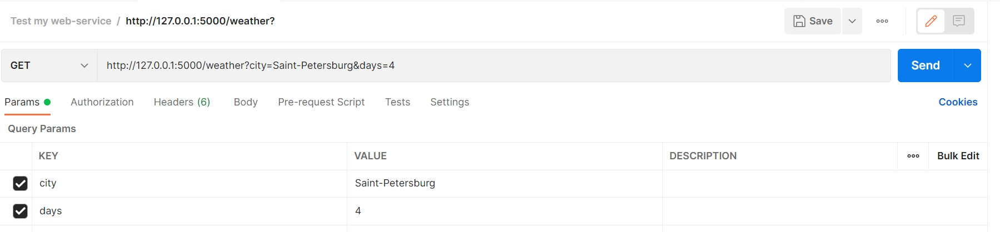
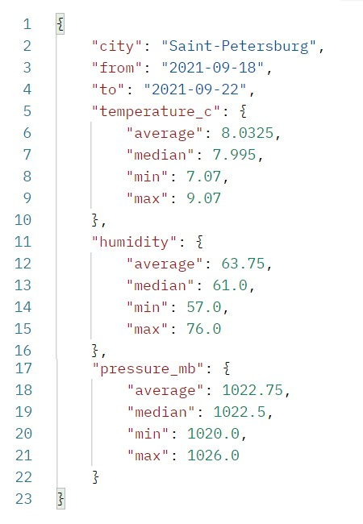

<h1>Weather </h1>

 Веб-сервис получает данные о погоде из публичного API (https://api.openweathermap.org/data/2.5/onecall/timemachine) и производит их агрегацию, после чего возвращает результат. 

Корректный формат запроса к сервису: GET /weather?city=<city>&days=<n>. Например, GET /weather?city=Saint-Petersburg&days=4 

Пример запуска сервиса: 

 

Сервис возвращает следующий json ответ: 

 

Запрос был выполнен с помощью платформы Postman (https://www.postman.com/product/what-is-postman/) 

